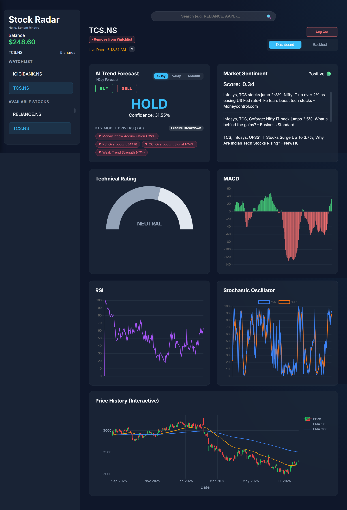
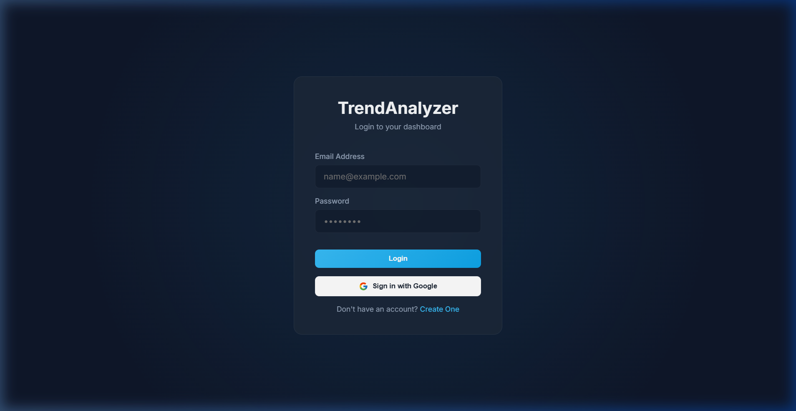
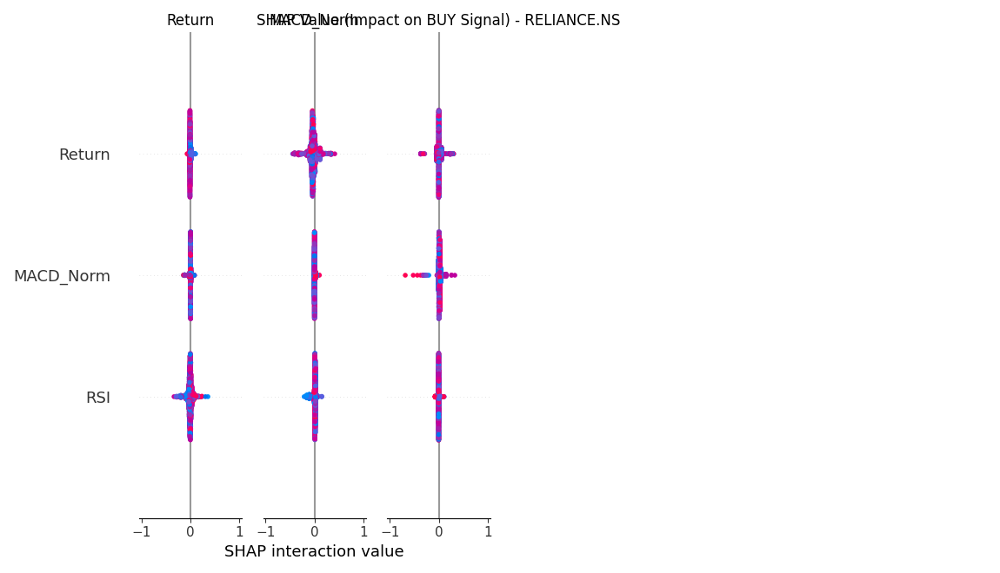
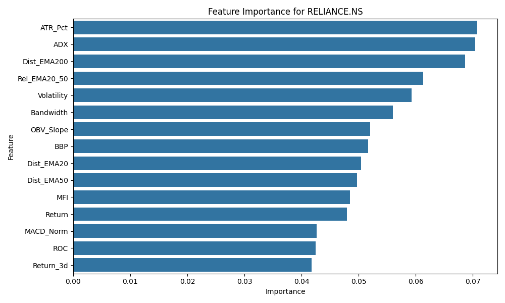
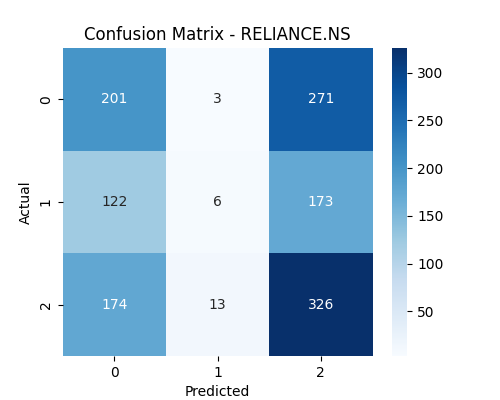
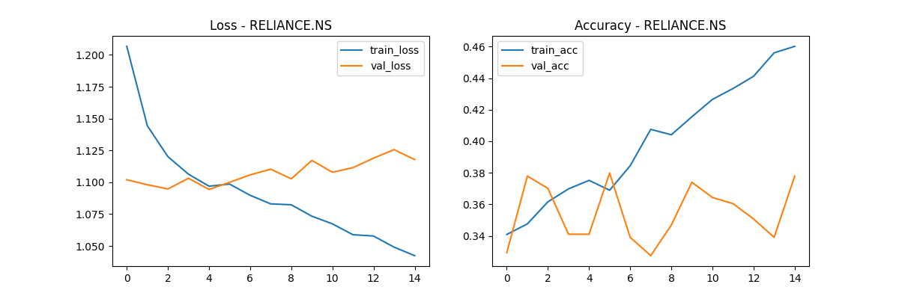

# 📈 Stock Market Trend Analyzer

[](https://python.org)
[](https://flask.palletsprojects.com/)
[](https://scikit-learn.org/)
[](https://huggingface.co/ProsusAI/finbert)
[](LICENSE)

An AI-powered quantitative analysis and trading recommendation platform tailored for **Indian equities (NSE)**. It generates high-probability short-term **BUY / SELL / HOLD** signals by combining an ensemble of deep learning and gradient-boosted trees, deep financial news sentiment analysis (FinBERT), macro indicators, and a responsive web dashboard with live charts, backtesting, and portfolio simulation.

---

## 🌟 Key Features

- **Multi-Model Stacking Ensemble**
  - **Bidirectional LSTM** for temporal sequence modeling.
  - **XGBoost, Random Forest, & Gradient Boosting** for non-linear tabular feature importance.
  - **Meta-labeling & Confidence Filtering** to weed out low-probability trade signals.
- **24+ Engineered Alpha & Technical Features**
  - RSI, MACD, Bollinger Bands, ADX, On-Balance Volume (OBV), Stochastic %K/%D, Multi-EMA spreads.
  - Macro factors: Nifty 50, USD/INR forex, crude oil, and gold spot rates.
- **Deep Financial News Sentiment Pipeline**
  - Production-grade GDELT & Google News historical ingestion.
  - Transformer-based **ProsusAI/finbert** NLP sentiment scoring for company-specific news.
  - Precision entity disambiguation and deduplication for 20+ NSE blue-chip stocks.
- **State-of-the-Art Web Trading Dashboard**
  - Dark glassmorphic interface with canvas-rendered star-grid background.
  - **Technical Rating Gauge**: 6-indicator aggregate scoring (RSI, MACD, EMA20, EMA50, EMA200, Stochastic %K).
  - Interactive multi-period price charts (Plotly / Chart.js).
  - Virtual portfolio manager, live watchlist alerts, and stock symbol lookup.
- **Backtesting & Explainability**
  - 365-day backtesting simulation with configurable stop-loss and take-profit thresholds.
  - **SHAP (SHapley Additive exPlanations)** feature attribution plots and model diagnostic audit tools.

---

## 📸 Screenshots & Dashboard Showcase

### Web Interface & Trading Analytics

| Live Dashboard & Technical Rating Gauge | User Authentication |
| :---: | :---: |
|  |  |

### Model Explainability & Evaluation

| SHAP Feature Attribution | Feature Importance Ranking |
| :---: | :---: |
|  |  |

| Confusion Matrix | Loss & Accuracy Convergence |
| :---: | :---: |
|  |  |

---

## 🛠️ Tech Stack

- **Backend**: Python 3.10+, Flask, SQLite (WAL mode)
- **Machine Learning**: TensorFlow / Keras (Bidirectional LSTM), XGBoost, scikit-learn
- **NLP & Sentiment**: Hugging Face Transformers (`ProsusAI/finbert`), NLTK VADER
- **Market Data & Ingestion**: `yfinance`, GDELT 2.0 API / Google Knowledge Graph (GKG)
- **Frontend**: HTML5, Vanilla CSS3 (Custom Glassmorphism Design System), JavaScript (ES6+), Plotly.js, Chart.js

---

## 🚀 Setup & Local Installation

### Prerequisites
- Python 3.10 or higher
- Git

### 1. Clone the repository
```bash
git clone https://github.com/sxoham/Stock-Market-Trend-Analyzer.git
cd Stock-Market-Trend-Analyzer
```

### 2. Set up virtual environment
```bash
# Windows
python -m venv .venv
.venv\Scripts\activate

# macOS / Linux
python3 -m venv .venv
source .venv/bin/activate
```

### 3. Install dependencies
```bash
pip install -r requirements.txt
pip install xgboost
```

*(Optional: For GPU/Transformer-accelerated FinBERT sentiment generation)*
```bash
pip install -r sentiment_generator/requirements.txt
```

### 4. Train models & run the web server
```bash
# Train or update stock models (Optional — pre-trained checkpoints can be generated)
python main.py

# Launch the Flask application
python app.py
```

Access the dashboard at **[http://localhost:5000](http://localhost:5000)** in your web browser.

---

## 📂 Project Architecture

```
STOCK MARKET TREND ANALYZER/
├── app.py                      # Flask application & REST API endpoints
├── main.py                     # ML training pipeline, indicator engineering & backtesting
├── sentiment.py                # Fast headline sentiment analyzer
├── requirements.txt            # Core project dependencies
├── sentiment_generator/        # Production GDELT + FinBERT sentiment pipeline
│   ├── news_fetcher.py         # Rate-limited multi-period news crawler
│   ├── finbert_sentiment.py    # Transformer batch inference
│   ├── aggregation.py          # Daily sentiment rollup & coverage metrics
│   └── cache.py                # SQLite cache & circuit breaker state
├── scripts/                    # Utilities, diagnostics & batch tasks
│   ├── make_daily_predictions.py
│   ├── audit_accuracy.py
│   ├── diagnose_model.py
│   └── analyze_predictions.py
├── templates/                  # Frontend HTML views
│   ├── index.html              # Main dashboard & portfolio interface
│   ├── login.html              # Authentication & login view
│   └── register.html           # User registration
├── static/                     # Assets & frontend logic
│   ├── script.js               # Dashboard interactions & API consumers
│   ├── style.css               # Modern glassmorphic theme & typography
│   └── stargrid.js             # Interactive background canvas
├── images/                     # Evaluation charts & UI screenshots
└── graphify-out/               # Knowledge graph & codebase architecture maps
```

---

## 🔌 API Reference

| Method | Endpoint | Description |
| :--- | :--- | :--- |
| `GET` | `/` or `/login` | Authentication & login interface |
| `GET` | `/dashboard` | Main trading dashboard & live portfolio |
| `GET` | `/api/stocks` | List of supported NSE equity tickers |
| `GET` | `/api/predict/<ticker>` | Live model signal, probabilities, and technical gauge metrics |
| `GET` | `/api/backtest/<ticker>` | 365-day backtest simulation & performance metrics |
| `GET` | `/api/sentiment/<ticker>` | News sentiment scores & recent news feed |
| `GET` | `/api/lookup?q=<query>` | Real-time stock symbol autocomplete search |
| `GET` | `/api/historical/<ticker>` | Historical OHLCV series for charting |

---

## 🧪 Testing & Diagnostics

Run test suites for entity matchers, news fetcher, and model pipelines:

```bash
# Run entity disambiguation unit tests
python -m unittest discover -s tests -p "test_*.py"

# Run prediction pipeline validation
python scripts/validate_pipeline.py

# Audit model accuracy across historical predictions
python scripts/audit_accuracy.py
```

---

## ⚠️ Disclaimer

This project is intended strictly for **educational, academic, and research purposes**. Stock trading involves significant financial risk. The signals generated by this system do not constitute financial advice. Always perform your own due diligence before making investment decisions.

---

## 👤 Author

- **[sxoham](https://github.com/sxoham)**
